# Maternar — Apresentação do Projeto

> **Sprint 1 — Maio 2026**
> Equipe: Gabriel Araujo de Pádua · Guilherme Dilio de Souza · Sheila Alves de Araujo

---

## O Problema

A prematuridade e a falta de acompanhamento pré-natal adequado são causas significativas de mortalidade neonatal no Brasil. Gestantes em situação de vulnerabilidade — baixa escolaridade, acesso limitado ao sistema de saúde, perfil nutricional de risco — frequentemente não recebem orientação preventiva no momento certo.

**O que falta?** Uma ferramenta acessível, com linguagem acolhedora, que identifique o perfil de cuidado da gestante e entregue orientações personalizadas durante toda a gestação.

---

## A Solução: Maternar

**Maternar** é um aplicativo móvel (Flutter) de acompanhamento pré-natal que usa **Inteligência Artificial** para classificar o perfil de cuidado de cada gestante e fornecer dicas personalizadas — tudo em linguagem simples e humanizada.

```
Gestante informa           IA classifica               App orienta
peso, altura, CEP   →      perfil de cuidado    →      dicas, alertas,
escolaridade, raça         (K-Means K=3)               consultas
```

**Público-alvo:** Gestantes usuárias do SUS, especialmente com perfis de maior vulnerabilidade.

---

## Stack Tecnológica

| Camada | Tecnologia |
|--------|-----------|
| App Mobile | Flutter (Dart) — Android & iOS |
| Backend / API | NestJS (TypeScript) + PostgreSQL |
| Motor de IA | Flask (Python 3.12) + Scikit-learn |
| Banco de Dados | PostgreSQL 15 (Docker) |
| Pipeline de Dados | Python — Pandas / Joblib / Psycopg2 |

---

## De onde vêm os dados?

O modelo foi treinado com **microdados históricos do DATASUS** — sistema público do Ministério da Saúde — cruzando 5 bases de dados:

| Base | O que captura |
|------|--------------|
| **SISVAN** | Peso, altura, IMC, estado nutricional, raça e escolaridade de cada gestante |
| **SINAN** | Taxa de sífilis gestacional e toxoplasmose por município |
| **SIM** | Taxa de mortalidade materna por município |
| **SIA** | Cobertura de consultas pré-natal por município |
| **CNES** | Quantidade de hospitais por município |

**Chave de cruzamento:** Cada gestante do SISVAN é enriquecida com indicadores do seu município/ano, criando um perfil individual + contextual.

---

## Pipeline de Dados (KDD)

```
SISVAN (individual)  ──┐
SINAN (município/ano) ─┤
SIM   (município/ano) ─┼──→ PostgreSQL → Pré-Processamento → Clustering → App
SIA   (município/ano) ─┤
CNES  (município/ano) ─┘
```

### Etapas executadas

1. **Extração** — Download automático das bases públicas e carga no PostgreSQL
2. **Limpeza** — Remoção de inconsistências biológicas (IMC < 10 ou > 80; altura < 1,30m)
3. **Feature Engineering** — 20 features criadas: IMC atual, ganho de IMC, log(sífilis), cobertura pré-natal, one-hot de raça e estado nutricional
4. **Normalização** — RobustScaler (resistente a outliers epidemiológicos)
5. **Redução Dimensional** — PCA: 90% da variância em 8 componentes
6. **Clustering** — K-Means K=3 (k-means++, 20 inicializações)
7. **Validação** — Hold-out 10%, Bootstrap IC 95%, ANOVA, Qui-Quadrado

---

## Por que K=3?

Foram testados **4 algoritmos** com **K=3 e K=4**, usando múltiplos critérios de seleção:

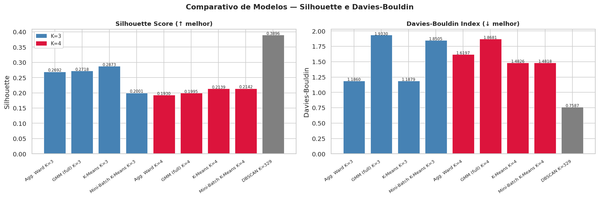

| Algoritmo | Silhouette K=3 | Silhouette K=4 | Vencedor |
|-----------|---------------|---------------|---------|
| K-Means | **0.2873** | 0.2139 | K=3 |
| Agglomerative Ward | **0.2692** | 0.1930 | K=3 |
| GMM | **0.2718** | 0.1995 | K=3 |
| Mini-Batch K-Means | 0.2001 | 0.2142 | K=3/K=4 |

**K=3 foi selecionado:** vence em 3/3 métricas internas e oferece maior interpretabilidade clínica.

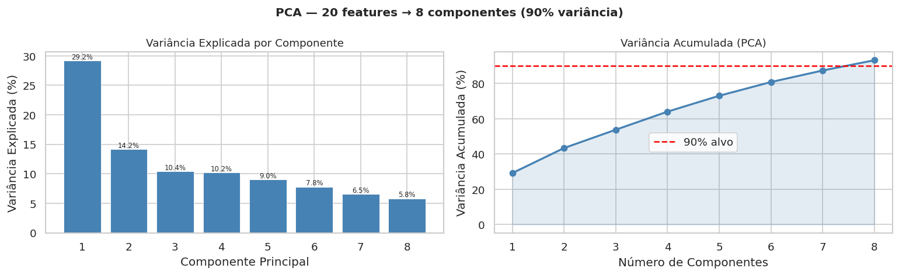

---

## Os 3 Perfis Identificados

Foram analisadas **378.969 gestantes** de **2.573 municípios** brasileiros (2014–2016):

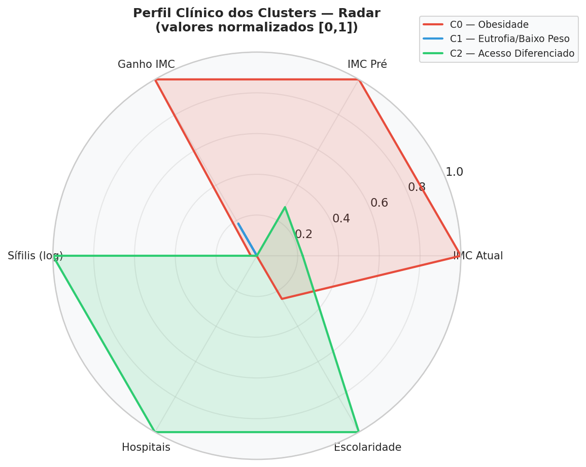

---

### Cluster 0 — Obesidade Gestacional (27,3% — 103.418 gestantes)

**Característica principal:** IMC pré-gestacional ≥ 31 kg/m²

| Indicador | Valor |
|-----------|-------|
| IMC atual | 34,0 kg/m² |
| IMC pré-gestacional | 31,0 kg/m² |
| Peso médio | 87,2 kg |
| Hospitais no município | 2,0 |

**Riscos:** Diabetes gestacional, hipertensão, pré-eclâmpsia, parto cesáreo.

**Orientações:** Nutricionista especializado, monitoramento intensivo de peso, rastreamento de pré-eclâmpsia.

---

### Cluster 1 — Eutrofia / Baixo Peso (71,2% — 269.787 gestantes)

**Característica principal:** IMC na faixa normal/baixo — grupo majoritário do SUS

| Indicador | Valor |
|-----------|-------|
| IMC atual | 24,6 kg/m² |
| IMC pré-gestacional | 22,7 kg/m² |
| Peso médio | 62,9 kg |
| Hospitais no município | 2,0 |

**Riscos:** Ganho insuficiente de peso, baixo peso ao nascer.

**Orientações:** Orientação nutricional básica, mínimo 6 consultas pré-natal, exames de rotina.

---

### Cluster 2 — Acesso Diferenciado (1,5% — 5.764 gestantes)

**Característica principal:** Município com alta concentração hospitalar (CNES)

| Indicador | Valor |
|-----------|-------|
| IMC atual | 26,7 kg/m² |
| Hospitais no município | **8,6** (4× acima da média) |
| Log taxa de sífilis | Levemente superior |

**Perfil:** Gestantes em grandes centros urbanos com alta infraestrutura — possivelmente gestações de alto risco encaminhadas para referência.

**Orientações:** Verificar VDRL/anti-HIV, vínculo com maternidade de referência.

---

## Visualizações dos Clusters

### Heatmap de Centroides

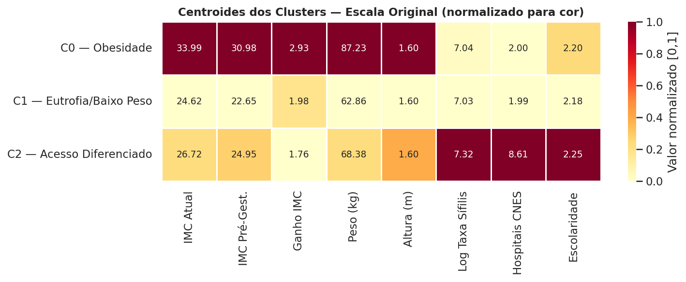

### Projeção PCA com Elipses de Confiança (95%)

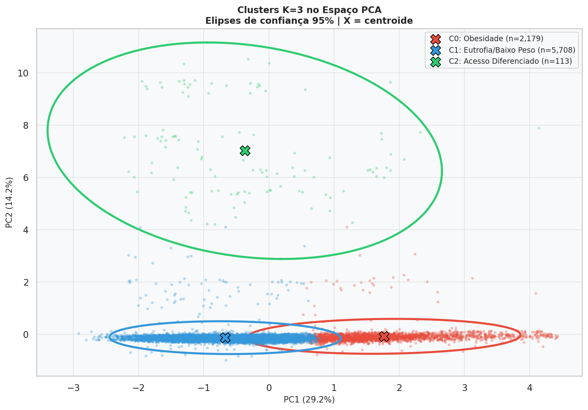

### Distribuição por Feature (Violin)

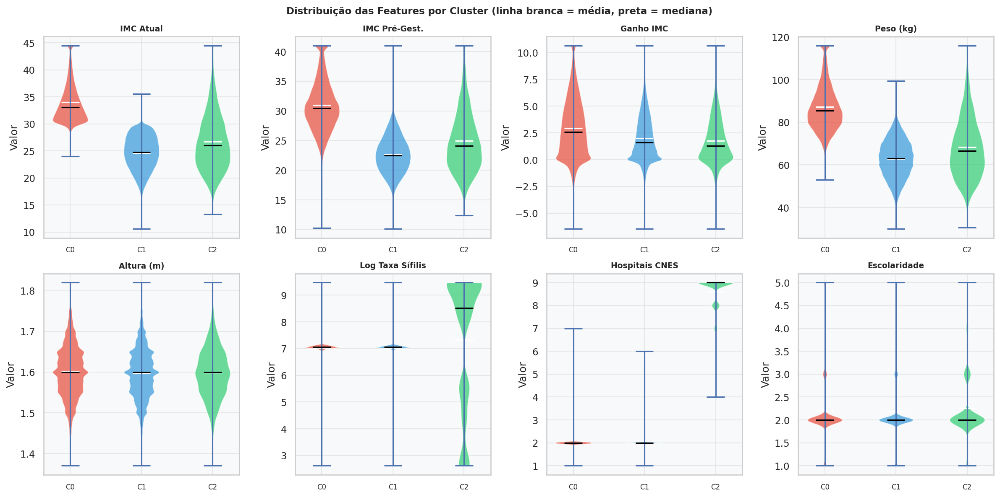

### Estado Nutricional por Cluster

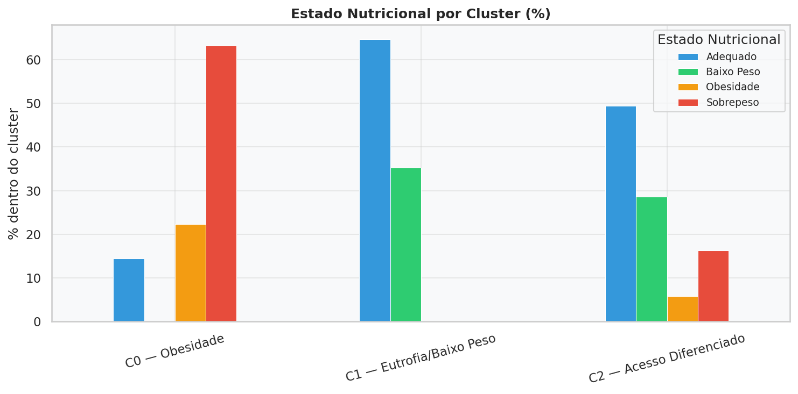

---

## Qualidade e Validação do Modelo

### Métricas principais

| Métrica | Valor | Referência |
|---------|-------|-----------|
| Silhouette Score | **0,2873** | > 0,20 aceitável em dados epidemiológicos |
| Calinski-Harabász | **102.169** | Quanto maior, melhor separação |
| Davies-Bouldin | **1,188** | Quanto menor, melhor |

### Estabilidade (Bootstrap — 30 amostras de 90%)

| Métrica | IC 95% Inferior | IC 95% Superior | σ |
|---------|----------------|----------------|---|
| Silhouette | 0,285 | 0,290 | < 0,001 |

**Conclusão:** Solução essencialmente determinística — o modelo produz sempre os mesmos clusters.

### Hold-Out (10% da base = 37.897 gestantes não vistas no treino)

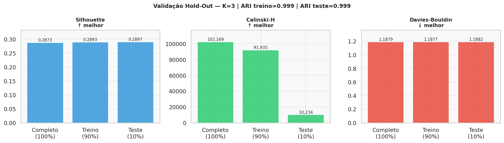

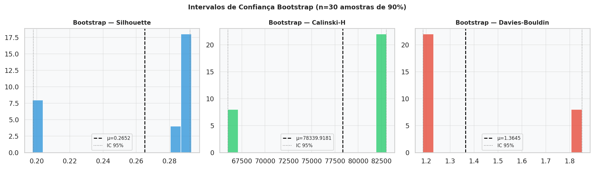

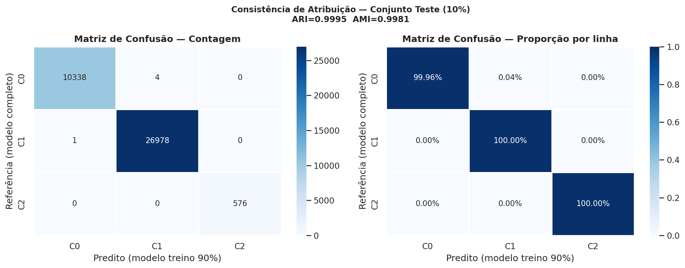

---

## Importância das Features (ANOVA)

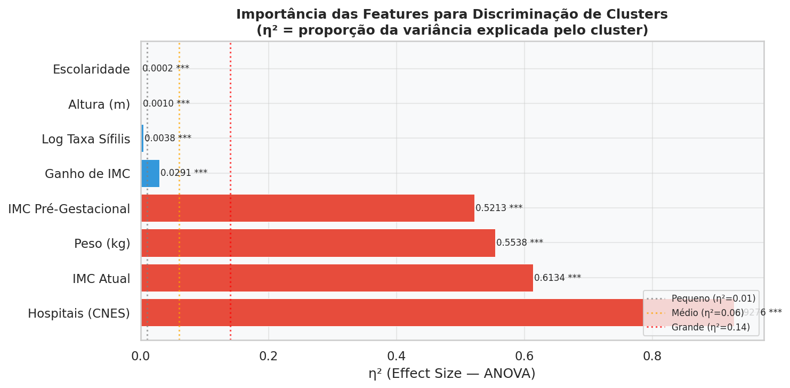

As features com **maior poder discriminatório** entre os clusters:

| Feature | η² | Magnitude |
|---------|-----|-----------|
| Hospitais (CNES) | 0,928 | Grande |
| IMC atual | 0,613 | Grande |
| Peso (kg) | 0,554 | Grande |
| IMC pré-gestacional | 0,521 | Grande |

---

## Análise Racial

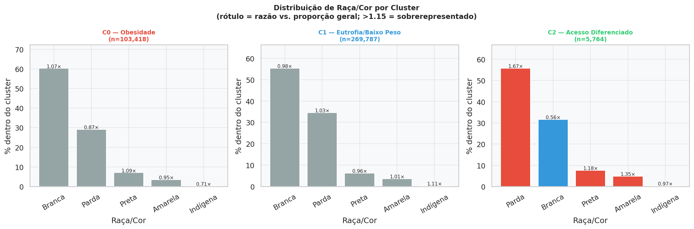

Qui-Quadrado Raça/Cluster: V de Cramér = 0,059 — diferença estatisticamente significativa (p < 0,001), mas de magnitude fraca, indicando que o modelo não discrimina fortemente por raça.

---

## Evolução Temporal dos Clusters (2014–2016)

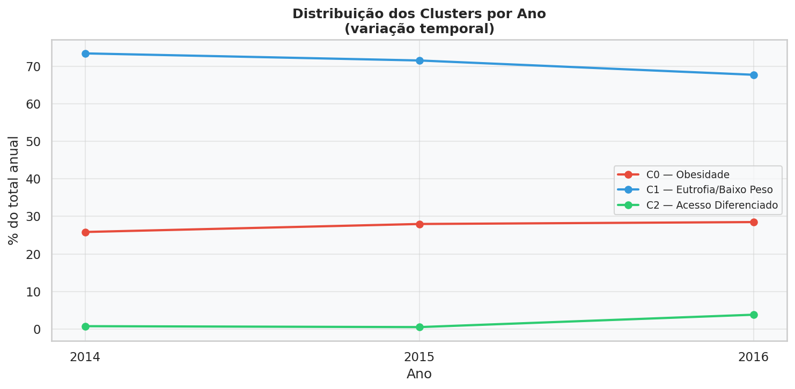

A distribuição dos clusters permanece estável entre os anos, confirmando a consistência do modelo ao longo do tempo.

---

## Arquitetura do Sistema

```
┌──────────────────────────────────┐
│  App Flutter                     │
│  Coleta: peso, altura, CEP,      │
│  escolaridade, raça              │
│  Exibe: cluster + dicas          │
└────────────┬─────────────────────┘
             │ HTTPS / JSON
┌────────────▼─────────────────────┐
│  Backend NestJS                  │
│  Autenticação JWT                │
│  Histórico de classificações     │
│  Notificações Push               │
│  Proxy → Flask                   │
└────────────┬─────────────────────┘
             │ HTTP interno
┌────────────▼─────────────────────┐
│  API Flask (Python)              │
│  Carrega: kmeans_k3.pkl          │
│            scaler_maternar.pkl   │
│            pca_maternar.pkl      │
│  Retorna: cluster_id + dicas     │
└──────────────────────────────────┘
             │
┌────────────▼─────────────────────┐
│  PostgreSQL                      │
│  schema app       → dados do app │
│  schema datasus   → dados DATASUS│
│  schema ml_maternar → ML         │
└──────────────────────────────────┘
```

---

## O que a IA retorna para o App

Dado o perfil de uma gestante (peso, altura, raça, escolaridade, município), a API Flask retorna:

```json
{
  "cluster_id": 0,
  "cluster_nome": "Obesidade Gestacional",
  "nivel_risco": "alto",
  "nu_imc_calculado": 33.5,
  "ganho_imc": 2.5,
  "recomendacoes": [
    "Encaminhar para nutricionista especializado em gestação",
    "Monitoramento intensivo: consultas a cada 2-3 semanas",
    "Rastreamento de pré-eclâmpsia e diabetes gestacional"
  ]
}
```

---

## Artefatos Produzidos (Sprint 1)

| Artefato | Descrição |
|----------|-----------|
| `kmeans_k3.pkl` | Modelo K-Means treinado e validado |
| `scaler_maternar.pkl` | RobustScaler para normalização em produção |
| `pca_maternar.pkl` | PCA (8 componentes, 90% variância) |
| `gestante_k3_final.parquet` | 378.969 gestantes com cluster atribuído |
| `relatorio_tecnico_k3.md` | Relatório técnico completo com métricas |
| 15 gráficos de validação | Hold-out, bootstrap, ANOVA, PCA, radar |
| `KDD_Maternar_Research.ipynb` | Notebook reprodutível (49 células) |

---

## Próximos Passos (Sprint 2)

- [ ] Implementar API Flask com os modelos `.pkl` treinados
- [ ] Desenvolver backend NestJS (autenticação + histórico)
- [ ] Criar telas Flutter: Questionário → Dashboard → Dicas
- [ ] Definir nomes acolhedores finais para os 3 clusters (substituir nomes técnicos)
- [ ] Validação clínica dos perfis com especialista em saúde materno-infantil
- [ ] Re-treinar com dados 2020+ (dados 2014–2016 podem não refletir realidade atual)

---

*Projeto Maternar — Sprint 1 — Dados: DATASUS 2014–2016 — Modelo executado em 2026-05-25*
